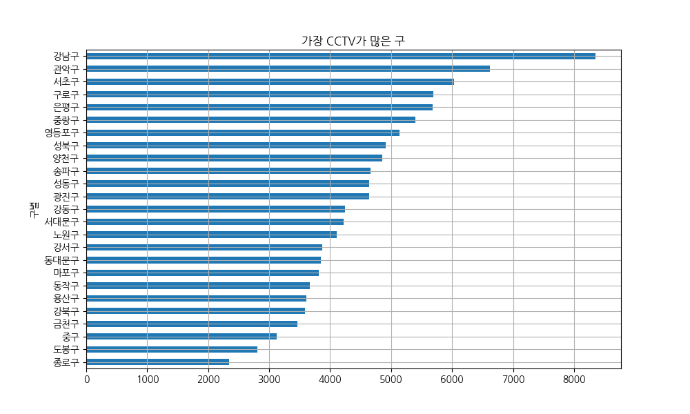
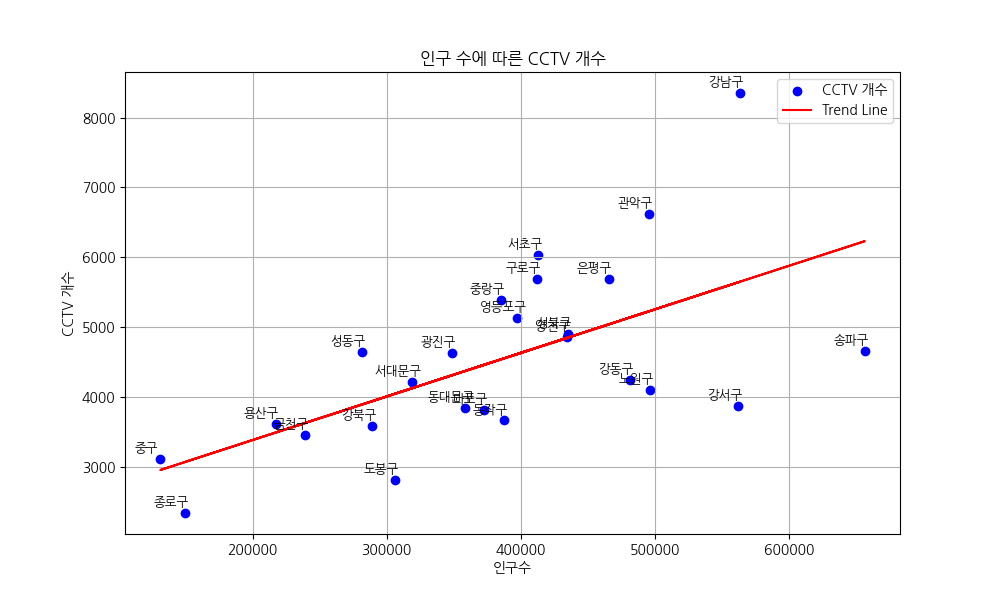

# 서울시 CCTV 데이터 분석

[](https://www.python.org/)

이 프로젝트는 **서울시 각 구별 CCTV 설치 현황**과 **인구 데이터**를 기반으로 CCTV 설치 비율과 인구수 간의 관계를 분석하는 내용입니다.

---

## 📁 데이터

- **CCTV 데이터**: [서울시 CCTV 데이터](https://data.seoul.go.kr/dataList/OA-2734/F/1/datasetView.do)
- **인구 데이터**: [서울시 인구 데이터](https://data.seoul.go.kr/dataList/419/S/2/datasetView.do)

---

## 🔧 사용 기술

| **카테고리**           | **기술 스택**                                                                                                                                                                                                                                                     |
|------------------------|--------------------------------------------------------------------------------------------------------------------------------------------------------------------------------------------------------------------------------------------------------------------|
| **OS & Editor**        |  &nbsp;                 |
| **Language & Library** |  &nbsp;  &nbsp;  &nbsp;  |
| **Version Control**    |  &nbsp;                                                 |

---

## 📊 분석 내용

- **CCTV 설치 현황**: 구별 CCTV 설치 대수 및 비율 분석
- **인구 대비 CCTV 비율**: 인구수 대비 CCTV 설치 비율 계산
- **시각화**: 산점도 및 경향선(Trend Line) 활용 데이터 시각화

### 예시 결과

<div align="center">
  
  <br/>
  <em>구별 CCTV 데이터 시각화</em>
  <br/><br/>
  
  <br/>
  <em>인구수에 따른 CCTV 개수</em>
</div>

---

## 🔍 주요 분석 결과

- **상관관계**: CCTV 개수와 인구수 간의 강한 상관관계는 관찰되지 않음.
- **집중 분포**: 강남구, 관악구 등 일부 지역에 CCTV가 집중되어 있음.
- **인구 대비 부족**: 송파구, 강서구 등 인구 밀집 지역 중 일부는 CCTV가 상대적으로 부족한 상황.

---

## 📌 문제점 및 개선 사항

### 1. Pandas 데이터프레임 인덱스 문제
- **문제**: `set_index("구별", inplace=True)` 사용 시 데이터가 `None`이 되는 문제 발생.
- **해결**: `inplace=True` 제거 후, `seoul_data = seoul_data.set_index("구별")` 방식으로 수정.

### 2. 그래프 시각화 개선
- **문제**: `seaborn` 대신 `matplotlib`을 사용하면서 `scatter()` 및 `plot()` 설정의 수동 처리 필요.
- **해결**: `np.polyfit()`과 `np.poly1d()`를 사용해 경향선을 직접 계산 및 추가.

### 3. Scatter Plot에서 구 이름 표기 문제
- **문제**: `plt.text()`와 `plt.annotate()`로 구 이름 표기 시 텍스트 겹침 현상 발생.
- **해결**: `xytext=(-10,5)` 등의 옵션으로 텍스트 위치 조정.

### 4. GitHub README 및 이미지 삽입 문제
- **문제**: GitHub Issue 업로드 이미지가 README.md에서 깨짐.
- **해결**: `/images` 폴더 생성 후, 이미지 파일을 상대 경로로 삽입.

### 5. Git Push 오류 (`fetch first` 문제)
- **문제**: 원격 저장소와 로컬 브랜치 동기화 문제로 `git push` 거부.
- **해결**: `git pull origin main --rebase` 명령어로 동기화 후, `git push origin main` 실행.

---

## 🚀 실행 방법

1. **데이터 다운로드**: 위 데이터 링크에서 CSV 파일을 다운로드합니다.
2. **필수 라이브러리 설치**:
   ```bash
   pip install pandas numpy matplotlib
